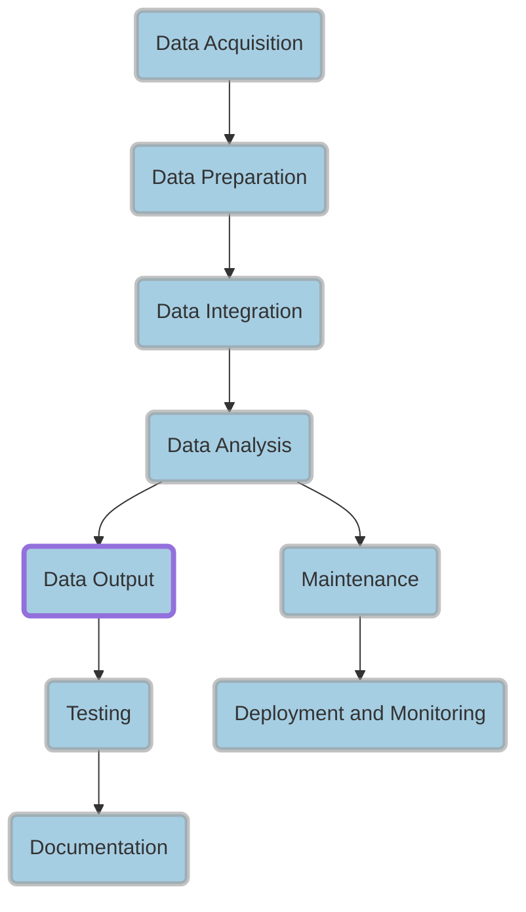

# Workflow: Soil Real Value

## Diagram:

## Workflow Summary:

- Obtain structured soil and tax or insurance data using Python and open data resources
- Load and clean datasets using SQL and Python libraries (e.g., Pandas)
- Join datasets using SQL and filter relevant attributes
- Calculate Land Value Score using Python calculations and domain knowledge
- Generate report in CSV, Excel, or JSON format and visualize results using geospatial tools or libraries (e.g., QGIS, Geopandas)
- Develop test cases using Python testing frameworks (e.g., Pytest) to ensure ETL process and Land Value Score calculations are correct
- Document process using Sphinx and include code comments for maintainability
- Use Git for version control and collaboration
- Technologies involved: Python, SQL, Pandas, Geopandas, Pytest, Sphinx, Git
- Consider cloud-based storage and computing, data compression, indexing and partitioning, modularity and code reusability for efficiency and maintainability

### Data Acquisition

- Obtain structured soil data using Python and open data resources
- Obtain tax or insurance data from reliable sources (e.g., local government or paid services)

### Data Preparation

- Load datasets into staging area using SQL and Python libraries (e.g., Pandas)
- Clean and standardize datasets (e.g., address missing values, standardize date formats, and remove duplicates)
- Create indexes on location identifiers for faster querying and joining

### Data Integration

- Join the soil and tax or insurance datasets on the common location identifier (e.g., parcel ID)
- Select relevant attributes from both datasets (e.g., soil quality, land value, property tax rates, and location)

### Data Analysis

- Rank the joined dataset based on the "Land Value Score"
- Identify a threshold for "high land value" areas (e.g., top 10%, or a specific Land Value Score)
- Potentially match the soil microbiology or mineral content to the land value potential

### Data Output

- Generate a report (CSV, Excel, or JSON) with the identified high land value areas, including their Land Value Score and relevant attributes
- Optionally, visualize the results on a map using geospatial tools or libraries (e.g., QGIS, ArcGIS, or a Python library like Geopandas)

### Testing

- Develop test cases to ensure the ETL process is working correctly (e.g., data loading, cleaning, and joining)
- Develop test cases to validate the Land Value Score calculations
- Develop test cases to verify the threshold for high land value areas
- Develop test cases to ensure the output report is generated correctly
